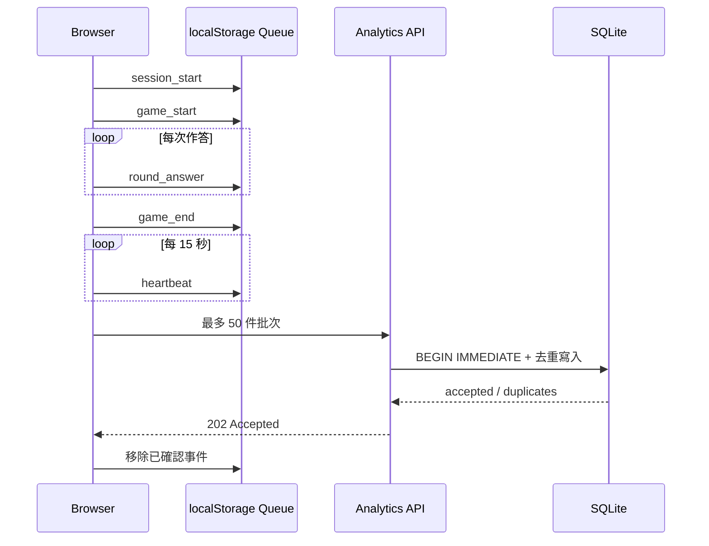
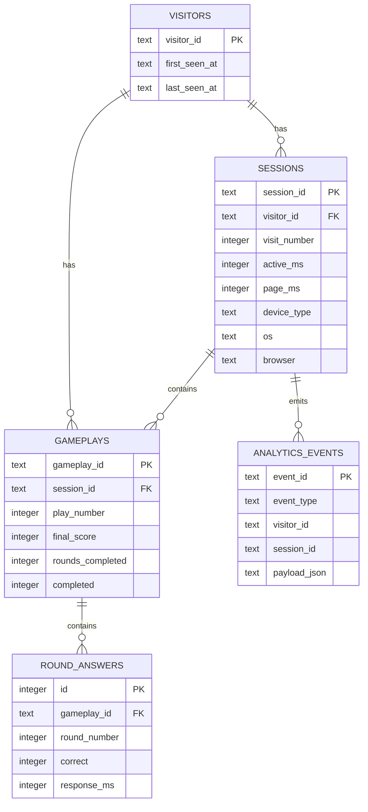

# 鴨鴨基因實驗室：個人數據後台開發技術報告

> 文件版本：1.0<br>
> 完成日期：2026-08-29<br>
> 適用專案：DuckFindBaby / 鴨鴨基因實驗室<br>
> 執行環境：Node.js 22.13 以上、Windows／Linux／macOS

## 1. 專案摘要

本次開發在既有網頁遊戲之外，新增一套可自行架設的匿名遊玩分析系統。玩家開啟遊戲後，瀏覽器會記錄工作階段、裝置類型、遊玩局數、分數、答題狀況、活躍時間與回訪次數等事件；Node.js 伺服器驗證並寫入本機 SQLite；管理者則透過需要密碼的響應式後台查看統計、趨勢和 CSV 明細。

系統採「遊戲、收集 API、管理後台同源」的單一服務設計，降低個人維護成本。它不依賴第三方分析平台，也不要求玩家建立帳號。資料與管理員密碼留在架設者自己的電腦，公開連線可以透過 HTTPS Tunnel 進入。

### 1.1 完成範圍

- 匿名訪客、工作階段、遊玩局數與逐題事件收集。
- 手機／平板／桌機、作業系統、瀏覽器、語言、時區與畫面尺寸統計。
- 頁面停留時間與前景活躍時間分開計算。
- 回訪、重玩、平均／最高分、平均通過題數、結束原因和每日趨勢。
- SQLite 本機持久化、WAL 模式、交易寫入、索引及資料保留期限。
- 密碼登入、簽章 Cookie、管理 API、CSV 匯出與手機版儀表板。
- 區網啟動與 Cloudflare Quick Tunnel 公開啟動流程。
- 自動設定檔、敏感檔案忽略規則、操作文件與整合測試。

### 1.2 不在本次範圍

- 玩家帳號、姓名、Email、電話或精準地理位置。
- 廣告追蹤、跨網站識別或裝置指紋。
- 多管理員角色、忘記密碼信件、OAuth 或企業單一登入。
- 由專案自動建立 Cloudflare 帳號、固定網域或 DNS 記錄。
- 高流量多節點部署、資料倉儲、即時串流或機器學習推薦。

## 2. 需求轉譯

原始需求可拆成四個問題：玩家是否進入、使用什麼設備、實際玩多久，以及是否再次回來或重玩。對應的系統資料如下。

| 業務問題 | 技術資料 | 後台呈現 |
| --- | --- | --- |
| 有多少人進入？ | `visitorId`、`sessionId`、`session_start` | 匿名玩家、工作階段、每日趨勢 |
| 用什麼設備？ | user agent 分類、螢幕、viewport、語言、時區 | 裝置、OS、瀏覽器分布 |
| 在線／活躍多久？ | `pageMs`、`activeMs`、heartbeat | 平均與總活躍時間、最近工作階段 |
| 玩了幾次？ | `gameplayId`、`playNumber`、`game_start` | 遊玩局數、每工作階段重玩率 |
| 是否重複回來？ | 持久 `visitorId`、`visitNumber` | 回訪玩家率、頻率分層 |
| 玩得如何？ | round、score、combo、duration、reason | 平均／最高分、分數分布、平均題數 |

`visitorId` 代表同一瀏覽器安裝環境，不等同真實自然人。無痕模式、不同瀏覽器、不同裝置或清除網站資料都會產生新的匿名玩家，因此後台數字應理解為「匿名瀏覽器」而非精準人口統計。

## 3. 技術選型

### 3.1 Node.js 內建 HTTP Server

伺服器使用 `node:http`，避免為小型個人後台增加 Web 框架的依賴與升級成本。路由、JSON、Cookie、CORS、靜態檔案與錯誤回應集中在 `server/app.mjs`，服務入口在 `server/index.mjs`。

### 3.2 Node.js 內建 SQLite

Node.js 22.13 以上提供 `node:sqlite`，本專案因此不需要編譯原生套件或額外資料庫服務。SQLite 適合單機、低維運成本、可直接備份的個人分析需求；WAL 模式可改善讀寫並行，`busy_timeout` 可降低短暫鎖定造成的失敗。

### 3.3 原生 HTML／CSS／JavaScript 儀表板

後台不需要打包工具即可由同一個 HTTP 服務供應。CSS 採 mobile-first 響應式設計，JavaScript 直接向管理 API 讀取資料並更新圖表、卡片及表格，使手機在外部連線時也能查看。

### 3.4 HMAC 簽章管理工作階段

登入成功後伺服器發出 12 小時有效的 Cookie。Cookie 內容包含到期時間與 HMAC-SHA256 簽章，不保存明文密碼；屬性包含 `HttpOnly`、`SameSite=Strict`，經 HTTPS／反向代理時增加 `Secure`。

### 3.5 Cloudflare Tunnel

`scripts/start-public-server.mjs` 負責啟動本機服務及 Quick Tunnel，讓外部手機不需路由器開埠即可透過 HTTPS 存取。Quick Tunnel 網址是臨時的；正式固定網址應改用 Named Tunnel 與自有網域。

## 4. 系統架構

```mermaid
flowchart LR
    P[玩家手機／電腦] -->|/game/| H[Node.js HTTP Server]
    P -->|事件批次 POST| C[/api/analytics/events]
    C --> V[格式／來源／速率驗證]
    V --> S[(SQLite WAL)]
    A[管理者手機／電腦] -->|/admin/| H
    A -->|密碼登入| L[/api/admin/login]
    A -->|簽章 Cookie| D[/api/admin/summary]
    A -->|簽章 Cookie| X[/api/admin/export.csv]
    D --> S
    X --> S
    T[Cloudflare Tunnel] <-->|HTTPS| H
```

所有主要功能由同一服務提供：

- `/game/`：遊戲與 PWA 靜態資源。
- `/admin/`：管理後台靜態資源。
- `/api/analytics/events`：公開但嚴格驗證的事件入口。
- `/api/admin/*`：需要管理員 Cookie 的查詢與匯出。
- `/healthz`：服務存活檢查。

## 5. 瀏覽器追蹤設計

### 5.1 識別碼生命週期

| ID | 產生方式 | 生命週期 | 用途 |
| --- | --- | --- | --- |
| `visitorId` | `crypto.randomUUID()` 加前綴 | localStorage 持久保存 | 匿名回訪辨識 |
| `sessionId` | 每次頁面工作階段產生 | 本次頁面 | 彙整一次造訪 |
| `gameplayId` | 每次開始遊戲產生 | 一局遊戲 | 彙整逐題與結果 |
| `eventId` | 每個事件產生 | 永久唯一 | 伺服器去重 |

### 5.2 事件流程



支援的事件為 `session_start`、`heartbeat`、`session_end`、`game_start`、`round_answer`、`game_end` 與 `settings_change`。完整欄位對照見 `.codex/skills/duck-analytics-backend/references/schema-and-events.md`。

### 5.3 在線時間與活躍時間

- `pageMs`：自頁面載入後經過的時間，包含背景分頁。
- `activeMs`：只有頁面可見時累積，較接近玩家實際觀看／操作時間。
- 每 15 秒產生 heartbeat，另每 5 秒嘗試清空事件佇列。
- 分頁進入背景時先累積活躍時間；離開頁面時以 `sendBeacon` 做最佳努力送出。
- SQLite 更新使用 `MAX`，延遲或順序不同的 heartbeat 不會把較大的時間覆蓋成較小值。

### 5.4 離線與錯誤容忍

事件先寫入 localStorage，最多保存最近 250 筆，每批最多送出 50 筆。請求失敗時資料保留，網路恢復、週期 flush 或下次載入時重送。事件 ID 是資料庫主鍵，所以重送不會重複計數。分析模組失效時不阻擋遊戲主流程。

玩家可在網址加入 `?analytics=off`，使該次載入不產生或送出分析事件。

## 6. API 與輸入防線

### 6.1 事件收集

`POST /api/analytics/events` 接受一個 envelope，包含頂層訪客 ID、工作階段 ID與 1 到 50 個事件。伺服器執行：

1. 檢查 CORS，同源請求或設定白名單才允許。
2. 依用戶端地址套用每分鐘速率限制。
3. 限制 JSON 最大 128 KiB。
4. 驗證 ID 長度／字元、事件白名單、陣列大小和 data 物件形狀。
5. 限制文字長度、數字範圍與事件時間可接受範圍。
6. 在 SQLite 單一交易內寫入事件和投影表。

成功回傳 HTTP 202，以及 `accepted` 與 `duplicates` 數量。

### 6.2 管理 API

| Route | 說明 |
| --- | --- |
| `POST /api/admin/login` | 驗證密碼並設定 12 小時 Cookie |
| `POST /api/admin/logout` | 清除 Cookie |
| `GET /api/admin/session` | 檢查登入狀態 |
| `GET /api/admin/summary?range=7d\|30d\|90d\|all` | 取得 KPI、趨勢、分布和最近 50 個工作階段 |
| `GET /api/admin/export.csv?range=...` | 匯出遊玩與裝置明細 |

所有 `/api/admin/` 資料路由均在查詢資料庫前驗證 Cookie；未登入回傳 401。密碼和簽章以 timing-safe compare 比對。

## 7. SQLite 資料模型



### 7.1 寫入一致性

- `BEGIN IMMEDIATE` 包住整批事件，任一錯誤會 rollback。
- `analytics_events.event_id` 主鍵搭配 `INSERT OR IGNORE` 提供冪等性。
- `(gameplay_id, round_number)` 唯一約束避免同一題重複。
- foreign key 與 cascade delete 維持訪客、工作階段及遊玩資料一致。
- 時間、分數、題數和 combo 採單調更新，較舊事件不覆蓋較新進度。

### 7.2 索引與保留期限

索引涵蓋工作階段起始時間、訪客時間、遊玩起始時間、工作階段遊玩、逐題順序與事件時間。啟動時依 `DUCK_RETENTION_DAYS` 清除過期訪客及原始事件；預設 730 天，設為 0 或負數則不自動清理。

## 8. 指標定義

| 指標 | 定義 |
| --- | --- |
| 匿名玩家 | 範圍內開始工作階段的不同 `visitorId` 數 |
| 工作階段 | 範圍內 `started_at` 的 session 數 |
| 遊玩局數 | 範圍內開始的 gameplay 數 |
| 正常結束局數 | `completed = 1` 的 gameplay 數 |
| 平均／最高分 | 已結束遊玩的平均分；範圍內所有遊玩的最高分 |
| 平均活躍時間 | 範圍內 session 的 `active_ms` 平均 |
| 回訪玩家 | 範圍內活躍且生命週期 session 數大於 1 的玩家 |
| 回訪率 | 回訪玩家 ÷ 範圍內匿名玩家 |
| 重玩工作階段 | 範圍內 gameplay 數大於 1 的 session |
| 重玩率 | 重玩工作階段 ÷ 至少開始一局的工作階段 |
| 平均題數 | 已結束 gameplay 的 `rounds_completed` 平均 |

報表範圍支援 7、30、90 日或全部。每日趨勢使用 `DUCK_REPORT_TIMEZONE`，預設 `Asia/Taipei`；資料庫時間以 ISO 8601 UTC 保存。

## 9. 後台介面

儀表板包含：

- 密碼登入畫面與登入狀態恢復。
- 期間切換、重新整理、登出與 CSV 下載。
- 匿名玩家、工作階段、遊玩局數、平均活躍、回訪率、重玩率等 KPI 卡片。
- 每日玩家／工作階段／遊玩趨勢。
- 裝置、作業系統、瀏覽器、來源、回訪頻率、分數與結束原因分布。
- 最近 50 個工作階段，ID 僅顯示截短值。
- 窄螢幕卡片堆疊、可觸控操作和必要的橫向表格容器。

後台以 DOM `textContent` 放入 API 資料，避免將不可信字串當成 HTML 執行。

## 10. 安全與隱私

### 10.1 已實作控制

- 不收集玩家姓名、Email、電話、帳號、精準位置或原始 IP。
- 管理密碼與 HMAC secret 只放在被 Git 忽略的 `.env.analytics`。
- 密碼至少 10 字元，session secret 至少 32 字元。
- 管理 Cookie 為 HttpOnly、SameSite=Strict、12 小時有效；HTTPS 時為 Secure。
- 收集與登入共享每地址每分鐘 180 次的記憶體速率限制。
- JSON 大小、事件種類、批次數、ID、型別、字串及數字範圍皆有限制。
- SQL 全部使用 prepared statements；靜態路徑限制在 `public/` 內。
- CSP、`nosniff` 與 referrer policy 由伺服器加入。
- `.gitignore` 排除資料庫、環境密鑰、Tunnel URL、PID、log 和建置輸出。

### 10.2 隱私注意事項

系統仍會保存 user-agent 與來源網址，以產生裝置／瀏覽器／來源報表。若面向公眾營運，應在遊戲附近提供隱私說明、資料用途、保存期限與停用方法，並依所在地法規調整。來源網址可能帶有查詢參數，正式營運可進一步只保存 hostname，降低意外夾帶資訊的風險。

### 10.3 公網注意事項

不要直接把本機 8788 連接埠暴露到網際網路。Quick Tunnel 適合短期個人使用，但網址取得者仍能看到登入頁與遊戲。固定營運應使用 Named Tunnel、自己的網域、Cloudflare Access 或等效外層存取控制，並維持作業系統和 Node.js 更新。

## 11. 設定與啟動

第一次執行 `npm run analytics:start` 會建立 `.env.analytics`，產生隨機密碼與 session secret。主要設定如下：

| 變數 | 預設 | 用途 |
| --- | --- | --- |
| `DUCK_SERVER_HOST` | `0.0.0.0` | 本機與區網監聽 |
| `DUCK_SERVER_PORT` | `8788` | HTTP 連接埠 |
| `DUCK_ADMIN_PASSWORD` | 自動產生 | 後台管理密碼 |
| `DUCK_SESSION_SECRET` | 自動產生 | Cookie HMAC 金鑰 |
| `DUCK_ANALYTICS_DB` | `./data/duck-analytics.sqlite` | SQLite 路徑 |
| `DUCK_REPORT_TIMEZONE` | `Asia/Taipei` | 報表日期時區 |
| `DUCK_RETENTION_DAYS` | `730` | 自動保留天數 |
| `DUCK_ALLOWED_ORIGINS` | 空白 | 額外允許的遊戲來源，逗號分隔 |
| `DUCK_TRUST_PROXY` | `false` | 是否信任反向代理 header |

Windows 可直接雙擊 `start-duck-server.bat` 或 `start-public-duck-server.bat`。前者供本機／區網，後者同時啟動臨時 HTTPS Tunnel。

## 12. 測試與驗收

### 12.1 自動測試

`tests/analytics-server.test.mjs` 在臨時資料夾建立真實 SQLite 並啟動隨機本機連接埠，驗證：

- 5 種事件成功接收與投影。
- 同一批重送全部判定 duplicate。
- 未登入不能讀 summary。
- 錯誤密碼被拒絕，正確密碼取得 Cookie。
- KPI、裝置分布與最近工作階段正確。
- CSV 可下載並包含資料。
- 遊戲、後台與 health endpoint 能被供應。

完整測試套件目前共 15 項，涵蓋遊戲引擎、配色、題目公平性、跳躍時鐘、離線資產、UI 元件、渲染 HTML 與分析後端。

### 12.2 驗證命令

```powershell
npm ci
npm run lint
npm test
npm run test:analytics
```

本次完成前另以桌面與手機 viewport 驗證後台登入／閱讀，並以外部 HTTPS Tunnel 驗證 `/admin/` 可從公網抵達。臨時公開網址與登入密碼不寫入版本庫。

## 13. 維運與備份

- 平時只需保持電腦、Node.js 進程和 Tunnel 運行。
- 停止服務後備份 `data/` 最安全。
- 若必須在線備份，同時保存 `.sqlite`、`.sqlite-wal`、`.sqlite-shm`。
- 定期檢查磁碟空間、`/healthz`、後台登入和最近資料時間。
- 變更密碼後重新啟動服務；既有 Cookie 仍依簽章 secret 有效，若需全部登出可同時更換 session secret。
- 還原時停止服務，放回同一路徑的資料檔，再啟動並驗證 KPI。

## 14. 主要檔案

| 路徑 | 責任 |
| --- | --- |
| `public/game/analytics.js` | 匿名事件、時間、佇列、重送、裝置分類 |
| `public/game/game.js` | 遊戲行為與事件串接 |
| `server/app.mjs` | HTTP、路由、驗證、登入、CORS、CSV、靜態檔 |
| `server/analytics-store.mjs` | SQLite schema、交易、投影、KPI、保留期限 |
| `server/index.mjs` | 設定檔、秘密產生、監聽與安全關閉 |
| `public/admin/` | 登入與響應式儀表板 |
| `scripts/start-public-server.mjs` | Quick Tunnel 啟動與網址擷取 |
| `tests/analytics-server.test.mjs` | 真實 HTTP＋SQLite 整合測試 |
| `docs/ANALYTICS_SERVER.md` | 使用與維運手冊 |
| `.codex/skills/duck-analytics-backend/` | 後續維護規則與資料契約 |

## 15. 已知限制與後續建議

1. 匿名玩家按瀏覽器 localStorage 計算，無法跨裝置合併。
2. `sendBeacon` 是最佳努力，突然斷電時最後少量事件可能延遲到下次開啟才送出。
3. 速率限制存在記憶體，重啟後歸零，且不適合多節點共享。
4. 後台目前為單一管理員密碼，無操作稽核與權限分級。
5. 報表查詢適合個人規模；資料量很大時應加入彙總表、分頁和查詢效能監控。
6. Quick Tunnel 網址會改變且無 SLA；長期公開應換 Named Tunnel。
7. 可新增隱私告知 UI、只保存 referrer hostname、資料刪除工具與自動加密備份。

## 16. 結論

本次開發完成一個可在個人電腦運行、能從外部手機查看、具匿名事件收集與密碼保護的遊戲數據後台。架構刻意維持少依賴與單機可維護性，同時用事件去重、交易、輸入驗證、簽章 Cookie、Git 忽略規則與自動測試建立基本可靠性。它已能回答進站人數、設備、活躍時間、回訪與重玩等核心需求，並保留未來升級固定網域、加強隱私與擴展報表的空間。
